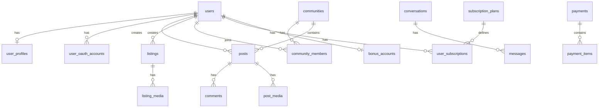

# Моделизм — план БД и API (Этап 1)

> Версия: 1.0 · 15.06.2026  
> Репозиторий: `git@github.com:letoceiling-coder/modelizmclub.git`  
> Dev-сервер: `dev.modelizmclub.ru` → `31.207.75.124` (Beget VPS, Ubuntu 24.04)  
> Файлы: Selectel S3 · БД: PostgreSQL 16

---

## 1. Стратегия разработки (gstack)

### 1.1 Принципы из ТЗ и gstack

| Принцип | Реализация |
|---------|------------|
| БД сразу под все 3 этапа | Все таблицы создаются в миграциях Этапа 1; неиспользуемые поля nullable / feature flags |
| API → потом фронт | Этап 1 = только `backend/` (Laravel API) + OpenAPI; фронт подключается после покрытия тестами |
| Модульность | Bounded contexts в `app/Modules/{Name}/` |
| Расширяемость | Полиморфные связи, enum через PHP 8.1 backed enums + таблицы справочников где нужна админка |
| Демо каждые 2 недели | `/ship` → PR на `develop`, деплой на `dev.modelizmclub.ru` |
| Безопасность | `/review` перед merge, 2FA админов, audit log |

### 1.2 Workflow gstack по фазам

```
/spec          → задачи в GitHub Issues (#343, #307, #308 как epic)
/plan-eng-review → финализация этого документа (архитектура, edge cases)
/freeze backend/ → изоляция работы агента на API
/ship          → PR + VERSION + CHANGELOG
/setup-deploy  → Beget: nginx, PHP-FPM, PostgreSQL, Redis, Reverb, certbot
/sync-gbrain   → индексация кодовой базы для поиска агентом
/qa            → smoke API после деплоя
```

### 1.3 Структура монорепозитория

```
modelizmclub/
├── backend/                 # Laravel 11 API (приоритет Этапа 1)
├── frontend/                # Next.js 15 (Этап 1 — только после API)
├── docs/
│   ├── PLAN-DB-API.md       # этот документ
│   ├── openapi/             # сгенерированная спецификация
│   └── adr/                 # Architecture Decision Records
├── deploy/                  # nginx, скрипты VPS, CI
└── .github/workflows/       # тесты в CI (не локально)
```

### 1.4 Стек — подтверждение и уточнения

**Оставляем по договору** (оптимален для ТЗ):

- **Laravel 11** + **PostgreSQL 16** — сложные связи, модерация, финансы, RBAC
- **Next.js 15** — лендинг + SPA (подключаем позже)
- **Laravel Reverb** (вместо устаревшего Laravel WebSockets) — WebSocket для чатов Этапа 2
- **Redis** — кэш, очереди, presence, rate limiting
- **Selectel S3** + `league/flysystem-aws-s3-v3` — медиа, аватары, вложения чатов
- **Laravel Sanctum** — SPA/mobile token auth
- **Socialite** — VK ID, Yandex ID
- **Spatie Laravel Permission** — роли (Гость через middleware, остальные — roles)
- **Spatie Media Library** или собственный `Media` + S3 (см. §6)

**Дополнительно (не противоречит договору):**

- **Meilisearch** (self-hosted на VPS) — полнотекстовый поиск объявлений/постов на русском
- **Laravel Horizon** — мониторинг очередей
- **Scramble** или **L5-Swagger** — автогенерация OpenAPI из контроллеров

---

## 2. Инфраструктура

### 2.1 SSH (статус)

- ✅ Вход по ключу `ssh-ed25519 ... bella-vps-20260308` работает
- ⚠️ PasswordAuthentication в `sshd_config` закомментирован (дефолт = включён)
- **Действие при стабильном соединении:**

```bash
# /etc/ssh/sshd_config.d/99-hardening.conf
PasswordAuthentication no
PubkeyAuthentication yes
PermitRootLogin prohibit-password
MaxAuthTries 3
```

После — `sshd -t && systemctl reload sshd`. Проверить вторую сессию до закрытия текущей.

### 2.2 Dev-сервер (целевая схема)

```
Internet → nginx (443, Let's Encrypt)
              ├── dev.modelizmclub.ru/          → frontend (Next.js, :3000)
              ├── dev.modelizmclub.ru/api/      → Laravel (:8000 или php-fpm)
              └── dev.modelizmclub.ru/reverb    → WebSocket (Этап 2)

PostgreSQL 16 · Redis 7 · PHP 8.3 · Node 22 (для фронта позже)
```

### 2.3 Окружения

| Env | Домен | Назначение |
|-----|-------|------------|
| dev | dev.modelizmclub.ru | единственное окружение разработки (VPS) |
| production | modelizmclub.ru | после Этапа 3 |

> Локально проект **не разворачивается**. Код пишется в IDE → push → `deploy/scripts/deploy-dev.sh` на VPS.

### 2.4 S3 (Selectel)

```
Bucket: modelizmclub-dev / modelizmclub-prod
Префиксы:
  avatars/{user_id}/
  posts/{post_id}/
  listings/{listing_id}/
  communities/{community_id}/
  chat/{message_id}/
  banners/
  temp/{upload_uuid}/   → lifecycle 24h, перенос после подтверждения
```

---

## 3. Архитектура API

### 3.1 Общие правила

- **Версионирование:** `/api/v1/...`
- **Формат:** JSON:API-подобный (data, meta, links) — единообразие для фронта
- **Пагинация:** cursor-based для ленты/чатов, offset для админ-таблиц
- **Сортировка:** whitelist через `Sortable` trait + `?sort=-created_at,title`
- **Фильтры:** `Filterable` trait + `?filter[status]=published&filter[city_id]=1`
- **Scopes:** Eloquent `scopePublished`, `scopeForModeration`, `scopeVisibleTo($user)`
- **Авторизация:** Policies на каждую модель + middleware `role:moderator|admin`
- **Rate limit:** login 5/min, register 3/min, upload 30/min, API 120/min
- **Idempotency:** заголовок `Idempotency-Key` для платежей (Этап 2)
- **Локализация:** все сообщения об ошибках на русском (`lang/ru/`)

### 3.2 Модульная структура Laravel

```
app/Modules/
├── Auth/           # регистрация, OAuth, 2FA админов
├── User/           # профили, интересы, блокировки, приватность
├── Category/       # деревья категорий (3 справочника)
├── Community/      # сообщества, заявки, участники
├── Feed/           # посты, комментарии, реакции, закладки, репосты
├── Listing/        # объявления, статусы, модерация
├── Chat/           # беседы, сообщения (Этап 2 — API готов в БД)
├── Billing/        # тарифы, подписки, платежи, промокоды, бонусы
├── Moderation/     # очереди, жалобы, стоп-слова
├── Advertising/    # баннеры
├── Support/        # FAQ, тикеты (Этап 3)
├── Admin/          # дашборд, аналитика, audit
├── Media/          # загрузки, S3, обработка изображений
└── Notification/   # email, push, in-app
```

Каждый модуль:

```
Modules/Feed/
├── Models/
├── Http/
│   ├── Controllers/Api/V1/
│   ├── Requests/
│   ├── Resources/
│   └── Middleware/
├── Policies/
├── Services/
├── Filters/
├── Sorts/
├── Scopes/
├── Enums/
├── Events/ + Listeners/
├── Jobs/
└── routes/api.php  → подключается в RouteServiceProvider
```

---

## 4. Схема базы данных

> **Все таблицы создаются в Этапе 1.** Поля для Этапов 2–3 помечены `(E2)` `(E3)`.

### 4.1 ER-диаграмма (верхний уровень)



### 4.2 Ядро: пользователи и авторизация

#### `users`

| Поле | Тип | Описание |
|------|-----|----------|
| id | bigint PK | |
| uuid | uuid unique | публичный ID в API |
| email | varchar unique nullable | |
| phone | varchar unique nullable | |
| password | varchar nullable | null для OAuth-only |
| email_verified_at | timestamp | |
| phone_verified_at | timestamp | |
| role | enum | guest→не в БД; user, subscriber, moderator, admin |
| status | enum | active, blocked, deleted, pending_verification |
| last_seen_at | timestamp | presence (E2) |
| registration_track | enum | community, listing — трек входа |
| locale | char(5) | default `ru` |
| deleted_at | soft delete | 152-ФЗ |
| timestamps | | |

Индексы: `email`, `phone`, `status`, `role`, `uuid`

#### `user_profiles`

| Поле | Тип |
|------|-----|
| user_id | FK unique |
| display_name | varchar |
| slug | varchar unique |
| avatar_media_id | FK nullable → media |
| city_id | FK nullable |
| bio | text |
| publications_count | int cached |
| followers_count | int cached |
| following_count | int cached |
| rating_score | decimal(8,2) (E2) |
| privacy_settings | jsonb |
| timestamps | |

#### `user_oauth_accounts`

| user_id, provider (vk, yandex), provider_user_id, token jsonb |

#### `user_interests`

| user_id, category_id (post_categories) — M:N |

#### `user_follows`

| follower_id, following_id, unique pair |

#### `user_blocks`

| blocker_id, blocked_id, reason, timestamps |

#### `email_verification_codes` / `password_reset_tokens`

Стандарт Laravel + `code` 6 цифр, `expires_at`

#### `admin_two_factor`

| user_id, secret, recovery_codes jsonb, enabled_at | — только admin/moderator

#### `personal_data_consents`

| user_id, document_version, ip, user_agent, accepted_at | — 152-ФЗ

---

### 4.3 Справочники и категории

**Три независимых дерева** (adjacency list + `path` ltree или nested set):

#### `post_categories` — для ленты/постов

| id, parent_id, name, slug, icon, sort_order, is_active, depth, path |

#### `community_categories` — для сообществ

| id, parent_id, name, slug, sort_order, is_active, depth, path |

#### `listing_categories` — для объявлений

| id, parent_id, name, slug, sort_order, is_active, depth, path, listing_price_cents nullable |

#### `cities`

| id, name, region, slug, sort_order | — справочник городов

#### `tags`

| id, name, slug, usage_count |

#### `taggables` (polymorphic)

| tag_id, taggable_type, taggable_id |

#### `delivery_methods` (E3 — справочник без API интеграций)

| id, name, sort_order, is_active |

---

### 4.4 Сообщества

#### `communities`

| id, uuid, category_id FK, name, slug, description, cover_media_id, avatar_media_id, status (draft, pending, active, blocked), is_official, members_count, posts_count, settings jsonb, created_by (admin user_id), approved_at, timestamps |

#### `community_subcategories`

| id, community_id, name, slug, sort_order | — подкategории внутри сообщества

#### `community_members`

| community_id, user_id, role (member, moderator), joined_at, unique |

#### `community_applications`

| id, user_id, proposed_name, description, category_id, status (pending, approved, rejected), moderator_comment, reviewed_by, reviewed_at |

#### `community_pinned_posts`

| community_id, post_id, sort_order, pinned_at |

---

### 4.5 Лента (Feed)

#### `posts`

| id, uuid, user_id, community_id nullable, subcategory_id nullable, category_id FK, title, body, status (draft, pending_moderation, published, rejected, hidden, archived), rejection_reason, moderated_by, moderated_at, repost_of_id nullable, views_count, reactions_count, comments_count, published_at, timestamps, soft delete |

#### `post_media`

| id, post_id, media_id FK, sort_order, type (image, video), duration_seconds nullable |

#### `post_hashtags`

| post_id, hashtag_id | или парсинг из body в tags

#### `post_reactions`

| post_id, user_id, type (like, etc.), unique(post_id, user_id) |

#### `post_bookmarks`

| user_id, post_id, unique |

#### `post_reposts`

| id, user_id, original_post_id, repost_post_id nullable, created_at |

#### `comments` (древовидные, как Telegram)

| id, uuid, commentable_type (Post), commentable_id, user_id, parent_id nullable self-FK, root_id nullable, depth int, body, status, reactions_count, moderated_at, timestamps, soft delete |

> `root_id` + `parent_id` — быстрая выборка веток; `depth` max 5

#### `comment_reactions`

| comment_id, user_id, type, unique |

---

### 4.6 Объявления (Listing)

#### `listings`

| id, uuid, user_id, category_id, subcategory_id, title, slug, description, price_cents, currency (RUB), city_id, status enum см. ТЗ, rejection_reason, delivery_methods jsonb (E3), contact_via_messenger bool, views_count, favorites_count, paid_until, published_at, sold_at, expires_at, ai_draft jsonb nullable (E2), moderated_by, timestamps, soft delete |

**Статусы:** `draft`, `awaiting_payment`, `pending_moderation`, `published`, `rejected`, `revision`, `unpublished`, `sold`, `expired`

#### `listing_media`

| listing_id, media_id, sort_order |

#### `listing_favorites`

| user_id, listing_id |

#### `listing_status_logs`

| listing_id, from_status, to_status, actor_id, comment, created_at |

#### `listing_promotions` (E2)

| listing_id, type (boost, highlight), paid_until |

---

### 4.7 Мессенджер (E2 — таблицы в Этапе 1)

#### `conversations`

| id, uuid, type (direct, group, community), community_id nullable, title nullable, last_message_at, settings jsonb |

#### `conversation_participants`

| conversation_id, user_id, role (member, admin), joined_at, left_at nullable, last_read_message_id, muted_until |

#### `messages`

| id, uuid, conversation_id, user_id, body nullable, type (text, image, file, system), reply_to_id nullable, status (sent, delivered, read), edited_at, deleted_at soft |

#### `message_attachments`

| message_id, media_id |

#### `message_read_receipts`

| message_id, user_id, read_at |

---

### 4.8 Монетизация (E2 — таблицы в Этапе 1)

#### `subscription_plans`

| id, slug, name, description, price_cents, period_days, features jsonb, max_photos_per_post, free_listings_per_month, listing_discount_percent, priority_boost, badge_label, is_active, sort_order |

#### `user_subscriptions`

| id, user_id, plan_id, status (active, cancelled, expired), starts_at, ends_at, auto_renew, cancelled_at |

#### `listing_pricing_rules`

| id, category_id nullable, base_price_cents, duration_days, max_active_listings_free, settings jsonb |

#### `payments`

| id, uuid, user_id, amount_cents, currency, status, provider (vtb, yookassa), provider_payment_id, idempotency_key, paid_at, metadata jsonb |

#### `payment_items`

| id, payment_id, payable_type (UserSubscription, Listing), payable_id, description, amount_cents |

#### `promocodes`

| id, code unique, type (subscription_discount, subscription_free_period, free_listings, listing_discount), value, max_usages, max_usages_per_user, user_id nullable (персональный), valid_from, valid_until, is_active |

#### `promocode_usages`

| promocode_id, user_id, payment_id nullable, used_at |

#### `bonus_accounts`

| user_id PK, balance int |

#### `bonus_transactions`

| id, account_user_id, amount (+/-), type (accrual, spend, expire), source_type, source_id, expires_at nullable, description, created_at |

---

### 4.9 Модерация

#### `moderation_queue`

| id, moderatable_type, moderatable_id, queue (posts, listings, communities, comments), priority, assigned_to nullable, status (pending, in_review, done), created_at |

> Дублирует status на сущностях — очередь для UI админки

#### `moderation_actions`

| id, moderatable_type, moderatable_id, actor_id, action (approve, reject, revision, hide), reason, metadata jsonb, created_at |

#### `reports` (жалобы)

| id, reporter_id, reportable_type (User, Post, Listing, Message, Comment), reportable_id, reason enum, description, status (pending, resolved, dismissed), resolved_by, resolved_at |

#### `moderation_stop_words`

| id, word, is_regex, is_active |

#### `moderation_banned_patterns`

| id, pattern, type (url, keyword), is_active |

---

### 4.10 Реклама

#### `banners`

| id, placement (feed_top, feed_inline, sidebar), title, image_media_id, link_url, text, starts_at, ends_at, is_active, impressions_count, clicks_count |

#### `banner_events`

| banner_id, event (impression, click), user_id nullable, ip, created_at | — партиционирование по месяцам (E3)

---

### 4.11 Поддержка (E3)

#### `faq_categories`, `faq_articles`

#### `support_tickets`

| id, user_id, subject, status, assigned_to, created_at |

#### `support_messages`

| ticket_id, user_id, body, is_staff |

---

### 4.12 Медиа и загрузки

#### `media`

| id, uuid, disk (s3), path, filename, mime_type, size_bytes, width, height nullable, duration nullable, hash sha256, uploaded_by, status (pending, ready, failed), variants jsonb `{thumb, medium, large}`, metadata jsonb, created_at |

#### `media_attachments` (polymorphic)

| media_id, attachable_type, attachable_id, collection (avatar, gallery, attachment), sort_order |

> Альтернатива: Spatie Media Library — решение в ADR-001

#### `upload_sessions`

| id, uuid, user_id, purpose (avatar, post, listing, chat), expires_at, max_files, max_size |

Поток загрузки — см. §6.

---

### 4.13 Уведомления

#### `notifications` (Laravel database notifications + custom)

#### `notification_preferences`

| user_id, channel, type, enabled |

#### `email_templates`

| slug, subject, body_html, variables jsonb |

#### `push_subscriptions` (PWA, E3)

---

### 4.14 Админка и система

#### `audit_logs`

| id, user_id, action, auditable_type, auditable_id, old_values jsonb, new_values jsonb, ip, user_agent, created_at |

#### `system_settings`

| key, value jsonb, group | — key-value для тарифов, лимитов, SEO

#### `admin_dashboard_snapshots` (E3 — кэш метрик)

---

### 4.15 Вспомогательные / pivot (сводка)

| Таблица | Назначение |
|---------|------------|
| `password_reset_tokens` | Laravel |
| `sessions` | Laravel |
| `jobs`, `failed_jobs` | очереди |
| `cache` | database cache fallback |
| `permission_tables` | Spatie roles/permissions |
| `personal_access_tokens` | Sanctum |
| `telescope_entries` | dev only |

---

## 5. API Endpoints (v1)

### 5.1 Auth

```
POST   /api/v1/auth/register              # email + код
POST   /api/v1/auth/verify-email
POST   /api/v1/auth/login
POST   /api/v1/auth/logout
POST   /api/v1/auth/forgot-password
POST   /api/v1/auth/reset-password
GET    /api/v1/auth/oauth/{provider}/redirect
GET    /api/v1/auth/oauth/{provider}/callback
POST   /api/v1/auth/consent               # 152-ФЗ
GET    /api/v1/auth/me
```

### 5.2 Users & Profiles

```
GET    /api/v1/users/{slug}
PATCH  /api/v1/users/me
GET    /api/v1/users/me/settings
PATCH  /api/v1/users/me/settings
PATCH  /api/v1/users/me/privacy
GET    /api/v1/users/me/interests
PUT    /api/v1/users/me/interests
POST   /api/v1/users/{id}/follow
DELETE /api/v1/users/{id}/follow
POST   /api/v1/users/{id}/block
GET    /api/v1/users/me/blocks
```

### 5.3 Categories

```
GET    /api/v1/categories/posts           # tree
GET    /api/v1/categories/communities     # tree
GET    /api/v1/categories/listings        # tree
GET    /api/v1/cities
GET    /api/v1/tags?q=
```

### 5.4 Communities

```
GET    /api/v1/communities
GET    /api/v1/communities/{slug}
POST   /api/v1/communities/apply          # заявка на создание
POST   /api/v1/communities/{slug}/join
DELETE /api/v1/communities/{slug}/leave
GET    /api/v1/communities/{slug}/members
GET    /api/v1/communities/{slug}/posts
```

### 5.5 Feed (Posts)

```
GET    /api/v1/feed                       # filter: all|following|category
POST   /api/v1/posts
GET    /api/v1/posts/{uuid}
PATCH  /api/v1/posts/{uuid}
DELETE /api/v1/posts/{uuid}
POST   /api/v1/posts/{uuid}/publish
POST   /api/v1/posts/{uuid}/react
DELETE /api/v1/posts/{uuid}/react
POST   /api/v1/posts/{uuid}/bookmark
DELETE /api/v1/posts/{uuid}/bookmark
POST   /api/v1/posts/{uuid}/repost
GET    /api/v1/posts/{uuid}/comments
POST   /api/v1/posts/{uuid}/comments
GET    /api/v1/comments/{uuid}/thread     # ветка обсуждения
```

### 5.6 Listings (E2 — маршруты регистрируем, 501 до реализации)

```
GET    /api/v1/listings
POST   /api/v1/listings
GET    /api/v1/listings/{uuid}
PATCH  /api/v1/listings/{uuid}
POST   /api/v1/listings/{uuid}/submit     # → awaiting_payment
POST   /api/v1/listings/{uuid}/publish
POST   /api/v1/listings/{uuid}/sold
GET    /api/v1/listings/{uuid}/similar
POST   /api/v1/listings/ai-assist         # E2 experimental
```

### 5.7 Chat (E2)

```
GET    /api/v1/conversations
POST   /api/v1/conversations
GET    /api/v1/conversations/{uuid}/messages
POST   /api/v1/conversations/{uuid}/messages
POST   /api/v1/conversations/{uuid}/read
```

### 5.8 Billing (E2)

```
GET    /api/v1/plans
GET    /api/v1/plans/compare              # таблица тарифов
POST   /api/v1/subscriptions
GET    /api/v1/subscriptions/me
POST   /api/v1/payments
POST   /api/v1/payments/{uuid}/confirm
POST   /api/v1/promocodes/validate
GET    /api/v1/bonus/history
```

### 5.9 Media

```
POST   /api/v1/media/upload-session       # получить presigned URLs
POST   /api/v1/media/confirm              # подтвердить загрузку
DELETE /api/v1/media/{uuid}
```

### 5.10 Moderation (moderator+)

```
GET    /api/v1/admin/moderation/queue
POST   /api/v1/admin/moderation/{type}/{id}/approve
POST   /api/v1/admin/moderation/{type}/{id}/reject
POST   /api/v1/admin/moderation/{type}/{id}/revision
GET    /api/v1/admin/reports
```

### 5.11 Admin (admin)

```
GET    /api/v1/admin/dashboard
CRUD   /api/v1/admin/users
CRUD   /api/v1/admin/categories/*
CRUD   /api/v1/admin/communities
CRUD   /api/v1/admin/plans
CRUD   /api/v1/admin/promocodes
CRUD   /api/v1/admin/banners
GET    /api/v1/admin/audit-logs
GET    /api/v1/admin/settings
PATCH  /api/v1/admin/settings
```

### 5.12 Public / Landing

```
GET    /api/v1/public/landing             # demo feed + featured listings
GET    /api/v1/public/stats
GET    /api/v1/legal/{slug}               # agreement, privacy, refund
```

---

## 6. Загрузка медиа (детальный поток)

### 6.1 Presigned upload (рекомендуется)

```
1. Client → POST /media/upload-session
   { purpose: "post", files: [{ name, size, mime }] }
   
2. API создаёт upload_sessions + media (status: pending)
   → возвращает presigned PUT URLs Selectel S3 (temp prefix)

3. Client загружает напрямую в S3

4. Client → POST /media/confirm { session_uuid, media_uuids[] }

5. Job ProcessMedia:
   - verify object exists in S3
   - virus scan (ClamAV optional)
   - generate variants (Intervention Image / imgproxy)
   - move temp → permanent prefix
   - update media.status = ready

6. Client прикрепляет media_id к post/listing через API
```

### 6.2 Ограничения

| Purpose | Max files | Max size | MIME |
|---------|-----------|----------|------|
| avatar | 1 | 5 MB | jpeg, png, webp |
| post | 10 | 10 MB each | jpeg, png, webp |
| post_video | 3 | 100 MB | mp4, webm |
| listing | 20 | 10 MB | jpeg, png, webp |
| chat | 10 | 25 MB | + pdf, doc |

### 6.3 Request validation (`StorePostRequest` пример)

```php
'title' => ['required', 'string', 'max:200'],
'body'  => ['required', 'string', 'max:10000'],
'category_id' => ['required', 'exists:post_categories,id'],
'media_ids' => ['array', 'max:10'],
'media_ids.*' => ['uuid', 'exists:media,uuid', new MediaOwnedByUser, new MediaReady],
'hashtags' => ['array', 'max:30'],
```

---

## 7. Паттерны кода (образцы)

### 7.1 Filter (listing)

```php
// Filters/Listing/StatusFilter.php
public function __invoke(Builder $q, $value): void {
    $q->where('status', $value);
}
// Filters/Listing/PriceRangeFilter.php — filter[price_from], filter[price_to]
```

### 7.2 Scope

```php
// scopePublished, scopeVisibleTo(User $viewer)
// — скрывает blocked users, учитывает privacy_settings
```

### 7.3 Resource

```php
PostResource::collection($posts)->additional(['meta' => ['filters' => ...]]);
// PostResource: id (uuid), title, author (UserCompactResource), media, stats, permissions (can_edit)
```

### 7.4 Policy

```php
PostPolicy::update — owner + status draft|revision
PostPolicy::publish — owner + passes ModerationRules
```

---

## 8. План работ Этапа 1 (API + БД)

### Спринт 0 (3–4 дня): Фундамент

- [ ] Init monorepo, Laravel 11, push на GitHub
- [ ] Настройка VPS: `deploy/scripts/server-setup.sh`
- [ ] GitHub repo, branch strategy: `main`, `develop`, `feature/*`
- [ ] CI: PHPUnit, Pint, PHPStan level 6
- [ ] `/setup-deploy` → dev.modelizmclub.ru + SSL
- [ ] ADR-001: Media Library vs custom
- [ ] Base models: User, Media, Category trees

### Спринт 1 (5–7 дней): Auth + Users

- [ ] Миграции: users, profiles, oauth, consents, blocks, follows
- [ ] Sanctum + email verification code
- [ ] Socialite VK + Yandex (stub credentials)
- [ ] Policies, Resources, Filters
- [ ] Feature tests: register → verify → login → me

### Спринт 2 (5–7 дней): Categories + Communities

- [ ] 3 category trees + cities + tags
- [ ] Communities CRUD (admin), applications, members
- [ ] Seeders: 30+ categories из ТЗ
- [ ] Admin API categories (drag order → `sort_order`)

### Спринт 3 (7–10 дней): Feed

- [ ] Posts, comments (threaded), reactions, bookmarks, reposts
- [ ] Moderation queue auto-create on publish
- [ ] Feed filters: all / following / category
- [ ] Media upload flow end-to-end
- [ ] Tests: thread depth, moderation states

### Спринт 4 (5–7 дней): Moderation + Admin base

- [ ] Reports, stop words, moderation actions
- [ ] Admin: users, dashboard stats, audit log
- [ ] Role middleware (moderator, admin)
- [ ] 2FA for admins (TOTP)

### Спринт 5 (3–5 дней): Billing schema + stubs

- [ ] Миграции billing (без VTB интеграции)
- [ ] Plans CRUD admin, listing_pricing_rules
- [ ] API stubs с 501 для E2 endpoints
- [ ] OpenAPI generation

### Спринт 6 (3 дня): Hardening

- [ ] Rate limits, русские error messages
- [ ] `/review` security pass
- [ ] Backup script PG → S3
- [ ] Postman/Insomnia collection
- [ ] Demo на dev.modelizmclub.ru

**Итого Этап 1 API:** ~6 недель (совпадает с ТЗ)

---

## 9. Тестирование

| Уровень | Инструмент | Покрытие |
|---------|------------|----------|
| Unit | PHPUnit | Services, Enums, Filters |
| Feature | PHPUnit + RefreshDatabase | все API endpoints |
| Policy | PHPUnit | каждый Policy |
| Contract | OpenAPI diff in CI | breaking changes |
| E2E API | (E2) Pest + parallel | critical flows |

Критичные сценарии (Feature tests):

1. Регистрация community track vs listing track
2. Post: draft → moderation → published / rejected
3. Comment thread 3 levels deep
4. User block → скрытие контента
5. Media upload session → confirm → attach
6. Moderator approve/reject with audit trail

---

## 10. Решения для ADR (зафиксировать до кода)

| # | Вопрос | Рекомендация |
|---|--------|--------------|
| ADR-001 | Media | Custom `media` + `media_attachments` (полный контроль S3 presigned) |
| ADR-002 | Category tree | `parent_id` + materialized `path` varchar — проще drag-drop в админке |
| ADR-003 | UUID | UUID v7 (ordered) для публичных ID |
| ADR-004 | Search | Meilisearch с русским стеммингом (E2) |
| ADR-005 | WebSocket | Laravel Reverb + Redis |
| ADR-006 | Payment | Abstract `PaymentGateway` interface → VTB, fallback YooKassa |
| ADR-007 | Soft delete | users, posts, listings, comments — cascade rules в Service |

---

## 11. Следующие шаги (немедленно)

1. **Push в GitHub** scaffold (`backend/` Laravel + `deploy/`)
2. **VPS setup** — nginx, PHP, PostgreSQL, SSL на dev.modelizmclub.ru
3. **Selectel:** bucket + IAM keys → `.env` на сервере
4. **Спринт 1:** Auth API (регистрация, login, OAuth)
5. **GitHub Issues:** epic на каждый модуль из §3.2

---

## 12. Риски и митигация

| Риск | Митигация |
|------|-----------|
| Scope creep в Этапе 1 | Feature flags; E2 endpoints return 501 |
| VTB API документация | Абстракция PaymentGateway; mock в dev |
| WebSocket на Beget | Reverb на отдельном порту + nginx proxy |
| Большая БД upfront | Миграции модульные; неиспользуемые FK nullable |
| AI assist для объявлений | Отдельный service interface; stub в E1 |

---

*Документ подготовлен для старта разработки. Следующий артеfact: `docs/adr/ADR-001-media-storage.md` + первая волна миграций.*
