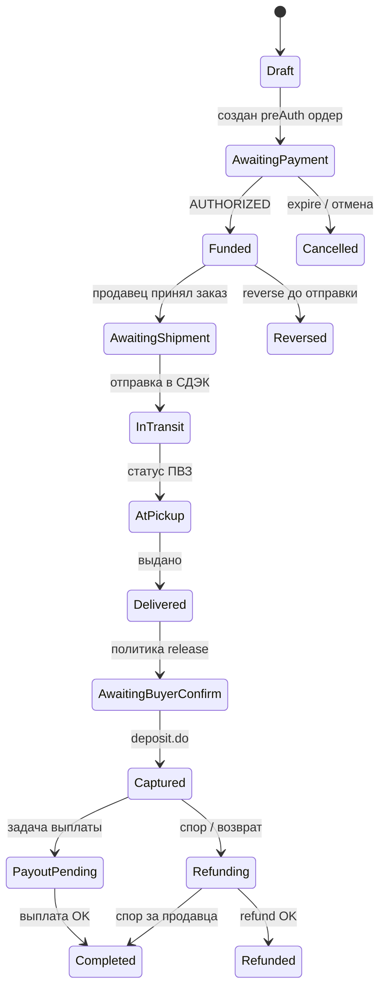

# Безопасная сделка на ВТБ — проектная логика

Дата: 2026-08-10  
Статус: **фаза 2 — пользовательский сценарий** (checkout, confirm, cancel; YooKassa prod + VTB при подключении credentials)  
Область: marketplace C2C — оплата объявления с доставкой, возвраты, выплаты продавцу.

**Источники:**

- Инструкция по API платёжного шлюза для мерчанта **v1.0.6.1** (ВТБ)
- [Документация двухстадийных платежей (legacy REST)](https://sandbox.vtb.ru/sandbox/ru/integration/api/scripts.html)
- Текущий код: `EscrowService` (ЮKassa Safe Deal), `Shipment` (СДЭК), `VtbPaymentGateway` (одностадийный legacy)

**Связанные документы:**

- [DELIVERY-IMPLEMENTATION-PLAN.md](./DELIVERY-IMPLEMENTATION-PLAN.md) — модуль доставки
- [seller-cabinet-audit.md](./seller-cabinet-audit.md) — аудит кабинета продавца и биллинга
- [API.md](./API.md) — HTTP-контракт (escrow, billing)

---

## 1. Цель

Реализовать **«Безопасную сделку»** для покупки моделей/товалов между пользователями:

1. Покупатель оплачивает сумму через **ВТБ** (деньги **не уходят продавцу сразу**).
2. Продавец отправляет товар (СДЭК / ПВЗ / самовывоз).
3. После **подтверждения получения** (перевозчик + покупатель) средства **списываются** и **выплачиваются продавцу** за вычетом комиссии платформы.
4. Поддерживаются **отмена**, **возврат**, **спор**.

---

## 2. Что даёт API ВТБ (v1.0.6.1)

Новый платёжный шлюз (REST + Bearer token):

| Операция | Эндпоинт | Назначение |
|----------|----------|------------|
| Создание ордера | `POST v1/orders` | Регистрация заказа, `payUrl` для редиректа |
| Статус ордера | `GET v1/orders/{orderId}` | Синхронизация при отсутствии callback |
| Возврат | `POST v1/refunds` | Полный или частичный возврат на карту покупателя |
| Статус возврата | `GET v1/refunds/{refundId}` | Проверка возврата |
| Callback | `PaymentResponse`, `RefundResponse` | Асинхронные уведомления |

**Статусы ордера:** `CREATED` → `PAID` → `REFUNDED` / `PARTIALLY_REFUNDED` / `EXPIRED`.

**Статусы транзакции (CARD):** `NEW` → `AUTHORIZED` → `CONFIRMED` (или `DECLINED`).

**Аутентификация:** OAuth2 `client_credentials` → `access_token`; заголовки `Authorization: Bearer …`, `X-IBM-Client-Id`, опционально `Merchant-Authorization`.

### 2.1. Legacy REST API (уже частично в коде)

Текущая интеграция (`VtbAcquiringClient`, `platezh.vtb24.ru` / sandbox):

| Метод | Назначение |
|-------|------------|
| `register.do` | Одностадийная оплата |
| `registerPreAuth.do` | **Двухстадийная** — холд на карте |
| `deposit.do` | Списание захолдированной суммы (capture) |
| `reverse.do` | Отмена холда до списания |
| `refund.do` | Возврат после списания |
| `getOrderStatusExtended.do` | Статус заказа |

Документация sandbox явно описывает **two-phase payment**: pre-auth → deposit или reverse.

### 2.2. Чего в документации ВТБ **нет**

- Готового продукта «маркетплейс / escrow» с автоматической выплатой на счёт продавца (аналог ЮKassa Safe Deal).
- Split-payment / номинального счёта в рамках API платёжного шлюза v1.
- API массовых выплат физлицам (это **отдельный банковский продукт** — уточнять у менеджера ВТБ).

**Вывод:** безопасная сделка = **композиция** эквайринга + учёта платформы + выплат с р/с мерчанта.

---

## 3. Трёхслойная архитектура

```
┌─────────────────────────────────────────────────────────────┐
│  Слой 1. Эквайринг ВТБ                                       │
│  preAuth / capture / reverse / refund                        │
└──────────────────────────┬──────────────────────────────────┘
                           │
┌──────────────────────────▼──────────────────────────────────┐
│  Слой 2. Escrow ledger (БД платформы)                        │
│  EscrowDeal / MarketplaceOrder — кому сколько и когда       │
└──────────────────────────┬──────────────────────────────────┘
                           │
┌──────────────────────────▼──────────────────────────────────┐
│  Слой 3. Выплата продавцу                                    │
│  Перевод с р/с ИП/ООО платформы → карта/счёт продавца       │
└─────────────────────────────────────────────────────────────┘
```

| Слой | Ответственность |
|------|-----------------|
| **Эквайринг** | Холд, списание, возврат на карту **покупателя** |
| **Ledger** | Статусы сделки, связь с доставкой, споры, комиссия |
| **Выплаты** | Перевод **продавцу** после release (не через `refunds`) |

«Общий счёт ВТБ» в пользовательском смысле = **расчётный счёт мерчанта (платформы)** + **внутренний escrow-учёт** обязательств перед продавцом. Номинальный счёт для маркетплейса — **отдельный договор с банком**, не описан в API v1.

---

## 4. Рекомендуемая платёжная модель

### 4.1. Вариант A (рекомендуемый): двухстадийная оплата

| Этап | API ВТБ | Бизнес-смысл |
|------|---------|--------------|
| Оформление | `registerPreAuth.do` | Холд полной суммы на карте покупателя |
| Успешная оплата | Callback, транзакция `AUTHORIZED` | Сделка «оплачена», деньги **не списаны** |
| Отмена до отправки | `reverse.do` | Холд снят |
| Подтверждение получения | `deposit.do` | Списание на р/с платформы |
| Возврат после списания | `refund.do` / `POST v1/refunds` | Возврат покупателю |
| Выплата продавцу | Банковский перевод / API выплат | Отдельный контур |

**Почему не одностадийная оплата:** при `register.do` / `PAID` деньги сразу на счёте платформы; «безопасность» только на уровне обязательства вернуть — слабее для покупателя и споров.

### 4.2. Вариант B: одностадийная + внутренний escrow

Технически проще, но хуже UX: списание сразу, отмена только через refund. Допустим, если банк **не** подключает двухстадийный режим.

### 4.3. Выбор API

| API | Когда использовать |
|-----|-------------------|
| **Legacy REST** (`registerPreAuth`, `deposit`, `reverse`) | Escrow-холд — **приоритет**, если включено в договоре |
| **v1** (`POST v1/orders`, `POST v1/refunds`) | Новый контракт с банком; уточнить поддержку двухфазности в v1 |
| **Текущий код** (`register.do`) | Только подписки/разовые платежи **без** escrow |

---

## 5. Связка с доставкой

### 5.1. Текущее состояние кода

| Модуль | Есть | Проблема |
|--------|------|----------|
| `EscrowDeal` + `EscrowService` | Да | Только ЮKassa (`yookassa_deal_id`, payout через YooKassa API) |
| `Shipment` + СДЭК | Да | Не связан с escrow |
| `confirmReceipt` | Да | Только ручное действие покупателя, без доставки |
| `VtbPaymentGateway` | Да | Одностадийный `register.do`, без escrow |

### 5.2. Целевая связь сущностей

```
MarketplaceOrder (новая или расширение EscrowDeal)
├── listing_id, buyer_id, seller_id
├── item_amount_cents
├── delivery_amount_cents      — кто платит: buyer | seller | split (правило)
├── platform_fee_cents
├── seller_payout_cents
├── payment_provider = vtb
├── vtb_order_id               — id ордера в шлюзе
├── vtb_preauth_status         — AUTHORIZED | DEPOSITED | REVERSED
├── escrow_deal_id             — FK → escrow_deals
├── shipment_id                — FK → shipments (nullable для самовывоза)
├── payout_status              — pending | processing | paid | failed
└── dispute_status             — none | open | resolved
```

**Правило:** финальный release (`deposit`) **не раньше**, чем выполнены условия политики (§7).

### 5.3. Статусы доставки (`ShipmentStatus`)

Используемые для триггеров:

| Статус | Роль в escrow |
|--------|---------------|
| `draft` / `quoted` | До оплаты |
| `created` / `accepted` | Продавец создал отправку |
| `in_transit` | Товар в пути |
| `at_pickup` | Ожидает в ПВЗ |
| `delivered` | Перевозчик подтвердил выдачу |
| `cancelled` | Отмена → `reverse` / refund по правилам |

---

## 6. Жизненный цикл сделки (state machine)

### 6.1. Диаграмма



### 6.2. Статусы `EscrowDeal` (целевые)

Расширение текущего enum (`pending_payment`, `paid`, `completed`, `cancelled`, `failed`):

| Статус | Описание |
|--------|----------|
| `pending_payment` | Ожидание оплаты / холда |
| `funded` | Холд успешен (`AUTHORIZED`), не списан |
| `awaiting_shipment` | Оплачено, ждём отправку продавца |
| `in_transit` | Доставка в пути |
| `delivered` | `Shipment.delivered` от перевозчика |
| `awaiting_buyer_confirm` | Можно подтвердить получение |
| `captured` | `deposit.do` выполнен |
| `payout_pending` | Выплата продавцу в очереди |
| `completed` | Продавец получил деньги |
| `dispute_open` | Открыт спор |
| `frozen` | Заморожена админом или автоматически при споре |
| `refunding` | Идёт возврат покупателю |
| `refunded` | Возврат завершён |
| `reversed` | Холд отменён до списания |
| `cancelled` | Сделка отменена |
| `failed` | Ошибка платежа или выплаты |

---

## 7. Политика release (когда списывать и платить)

| Режим | Условие `deposit` + выплаты | Риск |
|-------|----------------------------|------|
| A. Только перевозчик | `Shipment.status = delivered` | Средний |
| **B. Перевозчик + покупатель** | `delivered` + confirm покупателя | **Низкий (рекомендуется)** |
| C. Авто после delivered | `delivered` + 48–72 ч без спора | Удобно, риск споров |

**Рекомендация для МоДелизМ — режим B:**

1. СДЭК → `delivered` → статус `awaiting_buyer_confirm`.
2. Покупатель нажимает «Подтверждаю получение» **или** истекает **7 дней** без спора → auto-release.
3. До confirm/release выплата продавцу **заблокирована**.

Для **самовывоза** (нет `Shipment`): только ручной confirm покупателя; auto-release **не применять** без эскалации в поддержку.

---

## 8. Сценарии

### 8.1. Happy path (СДЭК → ПВЗ)

1. Покупатель: объявление → доставка → ПВЗ → итог (товар + доставка + комиссия).
2. Платформа: `MarketplaceOrder` + `Shipment` (draft → quote → confirm).
3. ВТБ: `registerPreAuth` на полную сумму → redirect `payUrl`.
4. Callback `AUTHORIZED` → `funded`.
5. Продавец: подтверждает заказ, создаёт отправку СДЭК → `in_transit`.
6. Webhook/sync СДЭК → `at_pickup` → `delivered`.
7. Покупатель подтверждает получение (или таймаут §7).
8. `deposit.do` → `captured`.
9. Выплата `seller_payout_cents` на `UserPayoutRequisites`.
10. Комиссия остаётся на р/с платформы.
11. Объявление → `sold` / снято с витрины.

### 8.2. Отмена до отправки

| Инициатор | Условие | Действие ВТБ | Статус |
|-----------|---------|--------------|--------|
| Покупатель | `funded`, shipment не создан | `reverse.do` | `reversed` |
| Продавец | отказ от сделки | `reverse.do` | `reversed` |
| Система | продавец не отправил за **N дней** (напр. 5) | `reverse.do` | `cancelled` |
| Система | истёк срок ордера ВТБ (`EXPIRED`) | — | `cancelled` |

### 8.3. Возврат после получения

1. Покупатель открывает **спор** в течение **X дней** (напр. 14) после `delivered`.
2. `dispute_open`, выплата **заблокирована**.
3. Модератор:
   - **За покупателя:** `refund` (полный/частичный) → `refunded`.
   - **За продавца:** `deposit` (если ещё не был) → выплата → `completed`.

### 8.4. Частичный возврат

API v1: `PARTIALLY_REFUNDED`. Пример: возврат стоимости товара без доставки. В ledger — отдельные строки `item_refund_cents`, `delivery_refund_cents`.

### 8.5. Ошибка выплаты продавцу

`captured`, но payout failed → `payout_pending` + retry queue + алерт админу. **Не** делать автоматический refund покупателю без решения — деньги уже на р/с платформы.

---

## 9. Роли

| Роль | Действия |
|------|----------|
| **Покупатель** | Оплата, выбор ПВЗ, confirm получения, спор, запрос возврата |
| **Продавец** | Принятие заказа, отправка, реквизиты выплат |
| **Перевозчик (СДЭК)** | Статусы через API/webhook |
| **Платформа** | Холд/capture/reverse/refund, ledger, модерация, выплаты |
| **ВТБ** | Эквайринг, callbacks |
| **Банк (выплаты)** | Перевод продавцу — отдельный договор |

---

## 10. HTTP-контракт (целевой)

Существующие эндпоинты (ЮKassa, без доставки):

| Метод | Путь | Описание |
|-------|------|----------|
| POST | `/listings/{uuid}/escrow/checkout` | Старт оплаты |
| GET | `/escrow/{uuid}` | Статус сделки |
| POST | `/escrow/{uuid}/confirm-receipt` | Confirm покупателя |

**Расширения для ВТБ + доставки:**

| Метод | Путь | Auth | Описание |
|-------|------|------|----------|
| POST | `/listings/{uuid}/marketplace/checkout` | ✓ | Checkout: escrow + shipment quote |
| POST | `/escrow/{uuid}/cancel` | ✓ | Отмена до capture (buyer/seller по правилам) |
| POST | `/escrow/{uuid}/dispute` | ✓ | Открыть спор |
| POST | `/escrow/{uuid}/confirm-receipt` | ✓ | Покупатель подтверждает получение |

**Admin API** (`/admin/escrow`, role: `admin`) — см. §17:

| Метод | Путь | Описание |
|-------|------|----------|
| GET | `/admin/escrow` | Список сделок (фильтры, пагинация) |
| GET | `/admin/escrow/stats` | Сводка для дашборда |
| GET | `/admin/escrow/{uuid}` | Карточка сделки (полный контекст) |
| POST | `/admin/escrow/{uuid}/sync-payment` | Синхронизация статуса с ВТБ |
| POST | `/admin/escrow/{uuid}/capture` | Списание (deposit), полное или частичное |
| POST | `/admin/escrow/{uuid}/reverse` | Отмена холда (reverse) |
| POST | `/admin/escrow/{uuid}/refund` | Возврат покупателю, полный или частичный |
| POST | `/admin/escrow/{uuid}/payout` | Выплата продавцу, полная или частичная |
| POST | `/admin/escrow/{uuid}/freeze` | Заморозка операций (dispute / manual hold) |
| POST | `/admin/escrow/{uuid}/unfreeze` | Снятие заморозки |
| POST | `/admin/escrow/{uuid}/cancel` | Отмена сделки по решению админа |
| POST | `/admin/escrow/{uuid}/resolve-dispute` | Закрыть спор с исходом |
| GET | `/admin/escrow/{uuid}/audit` | Журнал операций по сделке |

Webhook URL prod: `https://api.modelizmclub.ru/api/v1/payments/webhooks/vtb`.

---

## 11. Конфигурация (env)

```env
# Провайдер escrow-платежей
ESCROW_PAYMENT_PROVIDER=vtb          # vtb | yookassa

# ВТБ — двухстадийный режим для escrow
VTB_ACQUIRING_ENABLED=true
VTB_ACQUIRING_API_URL=https://platezh.vtb24.ru/payment/rest
VTB_ACQUIRING_USERNAME=
VTB_ACQUIRING_PASSWORD=
# или VTB_ACQUIRING_TOKEN=

# v1 API (если подключён новый шлюз)
VTB_GATEWAY_V1_BASE_URL=
VTB_GATEWAY_V1_CLIENT_ID=
VTB_GATEWAY_V1_CLIENT_SECRET=
VTB_GATEWAY_V1_MERCHANT_RESOURCE_ID=

# Политика release (дефолты; переопределяются SystemSetting — §18)
ESCROW_RELEASE_MODE=buyer_confirm    # carrier_only | buyer_confirm | auto_after_delivered
ESCROW_AUTO_RELEASE_DAYS=7
ESCROW_SELLER_SHIP_DEADLINE_DAYS=5
ESCROW_DISPUTE_WINDOW_DAYS=14

# Выплаты продавцу (отдельный продукт банка)
VTB_PAYOUT_ENABLED=false
```

**Тарифы и комиссия сервиса** — не в `.env`, а в **SystemSetting** (`escrow.*`) с редактированием в админке (§18).

---

## 12. Вопросы для менеджера ВТБ (блокер перед разработкой)

1. Доступен ли **двухстадийный** эквайринг (`registerPreAuth` + `deposit` + `reverse`) на prod для ИП Михайлова?
2. Какой API по договору: **legacy REST** или **v1** (`POST v1/orders`)?
3. Есть ли **номинальный / транзитный счёт** для маркetplace?
4. **Массовые выплаты** на карту / СБП — API, лимиты, сроки, комиссия?
5. **Максимальный срок холда** на карте (достаточно для доставки 5–14 дней)?
6. Настройка **autoReverse** / **autoCompletion** под SLA доставки?
7. **54-ФЗ:** кто пробивает чек — платформа, продавец, агентская схема?
8. Формат и **подпись callback** для prod.

---

## 13. Сопоставление с текущим кодом

| Компонент | Сейчас | Нужно для ВТБ escrow |
|-----------|--------|----------------------|
| `EscrowService` | ЮKassa Safe Deal | `VtbEscrowService` или strategy по провайдеру |
| `VtbPaymentGateway` | `register.do` | `registerPreAuth` + `deposit` + `reverse` |
| `VtbAcquiringClient` | 2 метода | + deposit, reverse, refund |
| `escrow_deals` | поля `yookassa_*` | + `vtb_order_id`, `shipment_id`, `payout_*` |
| `Shipment` | изолирован | FK из escrow, webhook → статус сделки |
| `UserPayoutRequisites` | хранение карты | + очередь выплат / API банка |
| Споры | нет | `disputes` table + admin UI |
| Feature flag | `feature.escrow_enabled` | включать только при `VTB` escrow + выплатах |
| **Админ escrow** | нет | §17: `/admin?section=escrow`, все операции ВТБ |
| **Тарифы escrow** | `platform_fee_percent` в env | §18: SystemSetting tiered fee |

---

## 14. Фазы внедрения

| Фаза | Содержание | Зависимости |
|------|------------|-------------|
| **0** | Ответы банка, правила на сайте (возвраты — требование ВТБ к витрине) | — |
| **1** | PreAuth checkout, callback, статусы `funded` / `reversed`, самовывоз + manual confirm | Env ВТБ |
| **2** | Связь `escrow_deals.shipment_id`, release по §7 | Модуль Delivery |
| **3** | Очередь выплат продавцу, admin fallback | Договор выплат |
| **4** | Споры, full/partial refund | Модерация |
| **5** | Таймауты, auto-reverse, мониторинг, отчётность | Cron + алерты |
| **6** | **Админ-панель:** список/карточка сделок, все операции (§17) | Фазы 1–4 |
| **7** | **Настройки тарифов** escrow в SystemSetting + UI (§18) | Фаза 1 |

---

## 15. Отличие от ЮKassa Safe Deal

| Аспект | ЮKassa Safe Deal (текущий код) | ВТБ (целевая модель) |
|--------|----------------------------------|------------------------|
| Hold | `createDeal` + payment with settlement | `registerPreAuth` |
| Capture | Автоматически при payment | `deposit.do` после confirm |
| Payout продавцу | `createPayout` на карту через API | **Отдельный банковский перевод** |
| Отмена до delivery | Через deal lifecycle | `reverse.do` |
| Возврат | YooKassa refund API | `refund.do` / `POST v1/refunds` |
| Доставка | Не связана | `Shipment` drives статусы |

Миграция: провайдер-адаптер `EscrowPaymentProvider` interface; `YooKassaEscrowProvider` сохранить для fallback.

---

## 16. Чеклист готовности к prod

- [ ] Договор ВТБ: двухстадийный эквайринг включён
- [ ] Prod credentials + callback URL зарегистрированы
- [ ] Договор / процесс выплат продавцам
- [ ] Правила «Безопасной сделки» и возвратов на сайте
- [ ] Feature flag `escrow_enabled` включается только после smoke-теста
- [ ] E2E: оплата → СДЭК sandbox → delivered → confirm → payout
- [ ] E2E: отмена → reverse
- [ ] E2E: спор → partial refund
- [ ] Админ: список сделок, карточка, все операции из §17.2
- [ ] Админ: настройки тарифов §18, preview расчёта комиссии

---

## 17. Админ-панель — управление безопасными сделками

### 17.1. Навигация и UI

Новый раздел в `/admin?section=escrow` (рядом с «Доставка»):

| Элемент | Описание |
|---------|----------|
| Пункт меню | «Безопасные сделки» (`ShieldCheck` / `HandCoins`) |
| Список | Таблица с фильтрами, пагинацией, экспорт CSV |
| Карточка | Slide-over или `/admin/escrow/{uuid}` — полная информация + действия |
| Настройки | Блок в `/admin?section=settings` — карточка «Безопасная сделка» (§18) |

**Паттерн UI:** как `DeliverySection` в `admin.tsx` — stat-карточки сверху, таблица, боковая панель деталей.

### 17.2. Операции администратора (матрица)

Каждая операция: проверка статуса → вызов API ВТБ → запись в `escrow_operations` (audit) → обновление `EscrowDeal`.

| Операция | API ВТБ | Когда доступна | Тело запроса (admin) |
|----------|---------|----------------|----------------------|
| **Синхронизация** | `getOrderStatusExtended` / `GET v1/orders/{id}` | Всегда | — |
| **Capture (списание)** | `deposit.do` / confirm | `funded`, `awaiting_buyer_confirm`, спор закрыт за продавца | `{ amount_cents? }` — пусто = полная сумма холда |
| **Reverse (отмена холда)** | `reverse.do` | `funded`, до capture | `{ reason }` |
| **Полный возврат** | `refund.do` / `POST v1/refunds` | После `captured` | `{ reason }` |
| **Частичный возврат** | `POST v1/refunds` (partial) | После `captured`, остаток > 0 | `{ amount_cents, reason, allocation: item\|delivery\|fee }` |
| **Полная выплата продавцу** | Банковский payout API | После `captured`, не `frozen` | — |
| **Частичная выплата** | Payout API | После partial capture/refund | `{ amount_cents, reason }` |
| **Заморозка** | — (только ledger) | Любой активный статус | `{ reason, until? }` — блокирует capture/payout/refund |
| **Разморозка** | — | `frozen` / `dispute_open` | `{ resolution_note }` |
| **Отмена сделки** | reverse или refund по контексту | По правилам §8.2–8.3 | `{ reason, notify_parties }` |
| **Закрыть спор** | Комбинация refund/payout/capture | `dispute_open` | `{ outcome: buyer\|seller\|split, buyer_amount_cents?, seller_amount_cents?, note }` |

**Идempotency:** каждая admin-операция принимает `idempotency_key` (UUID) — повтор не дублирует платёж.

**Подтверждение:** destructive-действия (refund, reverse, cancel) — `AlertDialog` + обязательный `reason` (мин. 10 символов).

### 17.3. Данные в списке (таблица)

| Колонка | Источник |
|---------|----------|
| UUID / № сделки | `escrow_deals.uuid` |
| Объявление | `listing.title`, ссылка |
| Покупатель | `buyer.profile.display_name`, email, ссылка `/user/{slug}` |
| Продавец | `seller.profile.display_name`, ссылка |
| Сумма сделки | `amount_cents` |
| Комиссия сервиса | `platform_fee_cents` (расчёт §18) |
| К выплате продавцу | `seller_payout_cents` |
| Статус сделки | `EscrowDealStatus` + badge |
| Статус платежа ВТБ | `vtb_order_status` / `AUTHORIZED` / `DEPOSITED` |
| Доставка | `shipment.provider`, `shipment.status` |
| Трек-номер | `shipment.tracking_number` |
| Создана / обновлена | timestamps |
| Заморожена | icon если `frozen_at` |

**Фильтры:** статус сделки, статус доставки, провайдер (cdek/yandex/pickup), период, buyer/seller id, «только споры», «только frozen», «ошибка payout».

### 17.4. Карточка сделки (детальный вид)

#### Блок «Сделка»

- UUID, статус, timeline (status history)
- Объявление: фото, title, price, ссылка, статус listing
- Суммы: товар, доставка, **комиссия сервиса**, итого оплаты, захолдировано, списано, возвращено, выплачено продавцу
- Провайдер оплаты: `vtb` / `yookassa`
- ID ордера ВТБ, ID транзакций, ссылки на callback-лог

#### Блок «Покупатель» / «Продавец»

- ID, display_name, email (admin), телефон (если verified)
- Рейтинг, дата регистрации
- Реквизиты выплат продавца (маскированная карта last4)
- История сделок пользователя (count + link)

#### Блок «Доставка»

| Поле | Описание |
|------|----------|
| Тип | `courier` / `pickup` / `self_pickup` (самовывоз) |
| Провайдер | СДЭК / Яндекс / — |
| Метод | из `listing.delivery_methods` |
| Статус | `ShipmentStatus` + external_status |
| Трек-номер | + ссылка на трекинг перевозчика |
| ПВЗ отправки / получения | адреса из `source_point` / `destination_point` |
| Стоимость доставки | `delivery_cost_cents` |
| События | лента `ShipmentEvent` (как в admin delivery) |
| Даты | quoted, created, in_transit, delivered |

Кнопка «Открыть отправление» → существующая карточка `/admin?section=delivery` с pre-selected row.

#### Блок «Платёж и операции»

- Таблица `escrow_operations`: дата, тип, сумма, admin/user, idempotency, результат ВТБ, error
- Кнопки действий (§17.2) — disabled с tooltip «недоступно в статусе X»

#### Блок «Спор» (если есть)

- Инициатор, причина, вложения, переписка, решение модератора

### 17.5. Backend (модуль Admin)

```
Modules/Admin/Http/Controllers/Api/V1/
├── AdminIndexEscrowDealsController.php
├── AdminShowEscrowDealController.php
├── AdminEscrowStatsController.php
├── AdminEscrowSyncPaymentController.php
├── AdminEscrowCaptureController.php
├── AdminEscrowReverseController.php
├── AdminEscrowRefundController.php
├── AdminEscrowPayoutController.php
├── AdminEscrowFreezeController.php
├── AdminEscrowCancelController.php
├── AdminEscrowResolveDisputeController.php
└── AdminEscrowAuditController.php
```

**Resource:** `AdminEscrowDealResource` — агрегирует deal + listing + buyer + seller + shipment + payment + operations.

**Права:** только `role:admin`; все операции пишутся в `audit_logs` (как модерация объявлений).

### 17.6. Frontend

```
frontend/src/
├── lib/api/admin-escrow.ts          # типы + fetch/mutate
├── components/admin/EscrowSection.tsx
├── components/admin/EscrowDealDrawer.tsx
└── components/admin/EscrowSettingsCard.tsx   # в settings section
```

i18n: `pages.adminEscrow.*`, `pages.adminSettings.escrowFees.*`.

### 17.7. Сводная статистика (stat cards)

| Метрика | Описание |
|---------|----------|
| Активных сделок | status ∉ completed, cancelled, refunded |
| На холде (₽) | sum amount where funded |
| Ожидают выплаты | payout_pending count |
| Споры открыты | dispute_open count |
| Ошибки за 7 дней | failed operations |
| Комиссия за период | sum platform_fee_cents |

---

## 18. Настройки тарифов сервиса «Безопасная сделка»

### 18.1. SystemSetting keys

Хранение в `system_settings`, группа `escrow`:

| Key | Тип value (JSON) | Описание |
|-----|------------------|----------|
| `escrow.fee.enabled` | `{ enabled: bool }` | Взимать комиссию за сервис |
| `escrow.fee.percent` | `{ percent: number }` | Процент от суммы **товара** (0–30) |
| `escrow.fee.flat_threshold_cents` | `{ threshold_cents: number }` | Порог «низкой цены», напр. `100000` (= 1000 ₽) |
| `escrow.fee.flat_amount_cents` | `{ amount_cents: number }` | Фикс. комиссия **до порога**, напр. `30000` (= 300 ₽) |
| `escrow.fee.min_cents` | `{ min_cents: number }` | Минимальная комиссия при процентном расчёте |
| `escrow.fee.max_cents` | `{ max_cents: number \| null }` | Потолок комиссии (optional) |
| `escrow.fee.apply_to` | `{ base: "item" \| "item_plus_delivery" }` | База для процента |
| `escrow.release.mode` | `{ mode: string }` | §7 |
| `escrow.release.auto_release_days` | `{ days: number }` | |
| `escrow.release.seller_ship_deadline_days` | `{ days: number }` | |
| `escrow.dispute.window_days` | `{ days: number }` | |

Дефолты при seed — в `ReferenceDataSeeder` или migration.

### 18.2. Формула расчёта комиссии

**Пример из ТЗ:** до 1000 ₽ — **300 ₽** фикс; свыше — **процент**.

```
function calculateEscrowFee(itemCents, deliveryCents, settings):
    if not settings.enabled:
        return 0

    base = settings.apply_to == "item_plus_delivery"
        ? itemCents + deliveryCents
        : itemCents

    if base <= settings.flat_threshold_cents:
        fee = settings.flat_amount_cents
    else:
        fee = round(base * settings.percent / 100)
        fee = max(fee, settings.min_cents)
        if settings.max_cents != null:
            fee = min(fee, settings.max_cents)

    return fee
```

**Примеры** (threshold=100000, flat=30000, percent=5%, min=30000):

| Цена товара | Комиссия |
|-------------|----------|
| 500 ₽ | 300 ₽ (flat) |
| 1 000 ₽ | 300 ₽ (flat, на пороге) |
| 1 500 ₽ | 75 ₽ → **300 ₽** (min) |
| 10 000 ₽ | 500 ₽ (5%) |

### 18.3. Применение при checkout

1. **Quote** (`GET /escrow/quote?listing_uuid=…&shipment_uuid=…`) — preview для покупателя:
   - `item_cents`, `delivery_cents`, `service_fee_cents`, `total_cents`, `seller_payout_cents`
2. При **create checkout** — сервер **пересчитывает** fee по актуальным settings (не доверять клиенту).
3. Сохранять в `escrow_deals`: `platform_fee_cents`, `fee_snapshot` (JSON settings на момент сделки) — для аудита при смене тарифов.

**Правило:** изменение тарифов в админке **не меняет** уже созданные сделки.

### 18.4. UI настроек в админке

Карточка «Тарифы безопасной сделки» в `/admin?section=settings`:

| Поле | UI |
|------|-----|
| Включить комиссию | toggle |
| Фикс до порога | input ₽ + input «до суммы сделки ₽» |
| Процент свыше порога | input % |
| Мин. комиссия (при %) | input ₽ |
| Макс. комиссия | input ₽ (optional) |
| База расчёта | select: только товар / товар + доставка |
| Release mode | select + days |
| Preview | live-калькулятор: «При цене 800 ₽ → комиссия 300 ₽» |

Кнопка «Сохранить» → `PATCH /admin/settings` (batch), как существующие feature flags.

### 18.5. Отображение комиссии пользователю

- На checkout: строка «Сервис безопасной сделки: X ₽»
- В админ-карточке: breakdown
- В чеке/квитанции (если 54-ФЗ): отдельная позиция «услуга платформы»

### 18.6. Связь с `feature.escrow_enabled`

| Настройка | Эффект |
|-----------|--------|
| `feature.escrow_enabled = false` | Бейдж скрыт, checkout недоступен |
| `escrow.fee.enabled = false` | Сделки возможны без комиссии (прomo-период) |
| Оба true | Полный режим |

---

## 19. Журнал операций (`escrow_operations`)

Таблица для audit и админ UI:

| Поле | Тип | Описание |
|------|-----|----------|
| id | bigint | |
| escrow_deal_id | FK | |
| type | enum | sync, capture, reverse, refund, payout, freeze, unfreeze, cancel, dispute_open, dispute_resolve |
| amount_cents | int nullable | |
| currency | char(3) | |
| status | enum | pending, success, failed |
| provider | string | vtb, manual, internal |
| provider_reference | string nullable | orderId, refundId, payoutId |
| initiated_by | enum | system, buyer, seller, admin |
| admin_user_id | FK nullable | |
| idempotency_key | string unique | |
| request_payload | jsonb | |
| response_payload | jsonb | |
| error_message | text nullable | |
| created_at | timestamp | |

---

*Документ подготовлен для команды разработки МоДелизМ. Обновлять по мере ответов банка и уточнения API.*
