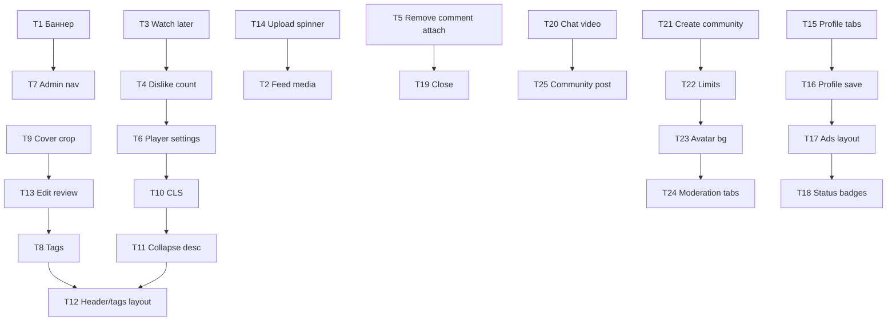

# План доведения до продакшена — 25 тестов (modelizm test.pdf)

**Источник:** [`modelizm test.pdf`](file:///C:/Users/dsc-2/Downloads/modelizm%20test.pdf)  
**Скриншоты:** [`docs/qa/modelizm-test-screenshots/`](./modelizm-test-screenshots/) (извлечены из PDF, 2026-08-12)  
**Статус:** FIXED — готово к ручному QA (2026-08-13)  
**Связанная матрица:** [`modelizm-test-matrix.md`](./modelizm-test-matrix.md) (старый снимок 34 пунктов, другая нумерация)

---

## Сводка по приоритетам

| Фаза | Тесты | Фокус | Оценка |
|------|-------|-------|--------|
| **0 — блокеры** | 1, 13, 20, 25 | Не работает / ломает данные | 3–5 дн. |
| **1 — обзоры (ядро)** | 3, 4, 6, 8–12, 14 | Страница обзора + админка обзоров | 7–10 дн. |
| **2 — лента и профиль** | 2, 5, 15–18 | Feed media, профиль, объявления | 4–6 дн. |
| **3 — сообщества и модерация** | 21–24 | Communities UX + admin moderation | 4–5 дн. |
| **4 — полировка** | 7, 16, 19 | Admin nav, валидации, дубли | 2–3 дн. |

**Зависимости:** тесты **8 → 12** (теги), **9 → 13** (обложка), **7 → 13** (единый раздел «Обзоры» в админке).

**Конфликт тестов 5 и 19:** в №5 просят **убрать** кнопки вложений в комментариях; в №19 — что они **не работают**. Решение: выполнить **№5** (убрать UI), №19 закрыть как дубликат.

---

## Фаза 0 — блокеры (сначала)

### Тест 1 — Не удаётся создать баннер

| | |
|---|---|
| **Маршрут** | `/admin` → Баннеры |
| **Скрин** |  |
| **Проблема** | При заполнении полей (заголовок 144, описание ~700, CTA 44, подпись 68, изображение) — «Не удалось создать баннер». Лимиты не показаны в UI. |

**Шаги исправления**

1. **Backend:** воспроизвести POST создания баннера, смотреть `laravel.log` — найти поле/validation, которое режет запрос.
2. **Backend:** сверить лимиты в `Banner` validation / migration с тем, что вводит QA; при необходимости расширить или явно вернуть 422 с `errors.field`.
3. **Frontend:** в `BannersAdminCard.tsx` — счётчики символов у title, description, cta, badge; `maxLength` + блокировка ввода сверх лимита.
4. **Frontend:** показывать текст ошибки из API (`errors.*`), а не общее «Не удалось создать баннер».
5. **QA:** повторить сценарий из PDF + граничные значения (ровно лимит / лимит+1).

**Файлы:** `frontend/src/components/admin/BannersAdminCard.tsx`, backend Banner controllers/requests, i18n admin banners.

**Критерий приёмки:** баннер с параметрами из PDF создаётся; при превышении лимита — понятная ошибка у поля, без 500.

---

### Тест 13 — Редактирование обзора из админки (сломано)

| | |
|---|---|
| **Маршрут** | `/admin` → Обзоры |
| **Скрины** | [форма](../qa/modelizm-test-screenshots/test-13-admin-edit-review.png) · [ошибка «Заменить медиа»](../qa/modelizm-test-screenshots/test-13-admin-edit-broken.png) · [replace media](../qa/modelizm-test-screenshots/test-13-admin-replace-media.png) |
| **Проблема** | Кнопка «Заменить медиа» открывает **страницу создания** нового обзора вместо edit-mode с подгруженными данными. Сохранение не должно создавать новый материал и не сбрасывать просмотры/реакции. |

**Шаги исправления**

1. **Backend:** `PATCH/PUT /admin/videos/{uuid}` — полное обновление (title, description, category, tags, cover, video, promo flags).
2. **Frontend:** маршрут `/reviews/upload?edit={uuid}` или `/admin/reviews/{uuid}/edit` — загрузка существующего обзора в форму.
3. **Frontend:** кнопка ✏/⚙ в `AdminReviewsSection` → edit route, не upload blank.
4. **Frontend:** submit вызывает update, не create; после save — toast + возврат в список.
5. **Регрессия:** просмотры, likes, comments ID не меняются (тот же uuid).

**Файлы:** `frontend/src/routes/reviews.upload.tsx`, admin reviews components, backend Video admin controllers.

**Критерий приёмки:** админ открывает обзор → все поля заполнены → меняет описание/обложку → «Сохранить» → на сайте обновлён тот же URL.

---

### Тест 20 — Видео пропадает из чата

| | |
|---|---|
| **Маршрут** | `/messenger` |
| **Скрин** |  |
| **Проблема** | Видео отправляется, показывается несколько секунд, затем исчезает из переписки. |

**Шаги исправления**

1. Воспроизвести: отправка video attachment, смотреть Network + WS + `laravel.log`.
2. **Backend:** проверить сохранение `message_attachments`, URL media, TTL signed URLs.
3. **Frontend:** после optimistic update — не затирать message пустым refetch; сверить merge логику в messenger store.
4. **Frontend:** если upload async — статус «отправляется» до confirm с сервера, не удалять bubble на error/reconcile.
5. Добавить feature test: send video message → GET conversation → attachment persists.

**Файлы:** messenger routes, `MessageService`, frontend messenger components, WS handlers.

**Критерий приёмки:** видео остаётся в истории после refresh; получатель тоже видит.

---

### Тест 25 — Нет возможности создать пост в сообществе

| | |
|---|---|
| **Маршрут** | `/communities/{slug}` |
| **Скрин** |  |
| **Проблема** | Владелец видит «Пока нет постов», но нет CTA «Создать пост». |

**Шаги исправления**

1. **Frontend:** для owner/admin — кнопка «Создать пост» во вкладке «Посты» и/или рядом с «Управление сообществом».
2. Открыть composer (reuse feed post form scoped to `community_id`).
3. **Backend:** POST post с `community_id` + permission check (owner/moderator).
4. Empty state: «Создать первый пост» для owner вместо пассивного текста.

**Файлы:** `communities.$id.tsx`, community post API, permissions.

**Критерий приёмки:** owner публикует пост → он виден во вкладке «Посты» у всех участников.

---

## Фаза 1 — Обзоры

### Тест 3 — Нет раздела «Смотреть позже»

| | |
|---|---|
| **Маршрут** | `/reviews`, `/reviews/{uuid}` |
| **Скрин** |  |
| **Проблема** | Кнопка работает (localStorage), раздела для просмотра списка нет. |

**Шаги**

1. **MVP (быстро):** вкладка «Смотреть позже» на `/reviews` — читает `lib/watch-later.ts`, карточки обзоров, empty state.
2. **Prod (желательно):** backend bookmarks API + sync между устройствами.
3. Toggle кнопки: filled bookmark + «Убрать из списка».
4. i18n: «Вы пока ничего не добавили…».

**Файлы:** `frontend/src/lib/watch-later.ts`, `reviews.index.tsx`, опционально backend bookmarks module.

---

### Тест 4 — Нет счётчика дизлайков

| | |
|---|---|
| **Скрин** |  |
| **Проблема** | У 👍 всегда `0`, у 👎 счётчик скрыт при 0. |

**Шаги**

1. `reviews.$id.tsx`: показывать `{dislikeCount}` всегда, как у likes (`0` если нет).
2. Сверить API `dislikes_count` в ответе detail.
3. Visual parity like/dislike buttons.

**Файлы:** `frontend/src/routes/reviews.$id.tsx` (~строка 485).

---

### Тест 6 — Настройки видеоплеера (качество + скорость)

| | |
|---|---|
| **Скрин** |  |

**Шаги**

1. Кнопка ⚙ на control bar плеера.
2. Popover: Quality (Auto/360/480/720/1080 — только доступные), Speed (0.5×–2×).
3. `localStorage` для предпочтений user.
4. Если HLS/multi-quality нет — скрыть недоступные, «Авто» = текущий source.

**Файлы:** review video player component, `reviews.$id.tsx`.

---

### Тест 8 — Теги обзоров (чипы + клик + поиск)

| | |
|---|---|
| **Скрины** | [референс Дзен](../qa/modelizm-test-screenshots/test-08-tags-dzen-example.png) · [текущее поле](../qa/modelizm-test-screenshots/test-08-tags-input.png) |

**Шаги**

1. **Upload/edit:** TagInput — Enter/`,` → chip, × удаление, max 10, autocomplete существующих.
2. **Backend:** tags как массив/normalized table `video_tags`, endpoint поиска по тегу.
3. **Detail:** кликабельные `#tag` → `/reviews?tag=...`.
4. Не смешивать с category.

**Зависимость:** блокирует **тест 12** (расположение тегов).

---

### Тест 9 — Адаптивная обрезка обложки обзора

| | |
|---|---|
| **Скрины** | [редактор](../qa/modelizm-test-screenshots/test-09-cover-crop-editor.png) · [как у баннера](../qa/modelizm-test-screenshots/test-09-cover-crop-banner-ref.png) |

**Шаги**

1. Reuse `CropSafeZoneOverlay` / `PhotoEditorDialog` из баннеров.
2. Две зоны: mobile safe / desktop safe, затемнение вне зоны.
3. Сохранять crop metadata в media/video record.

**Файлы:** `frontend/src/components/media/CropSafeZoneOverlay.tsx`, review upload flow.

---

### Тест 10 — Дёргается страница при переходе в «Рекомендуем»

| | |
|---|---|
| **Скрин** |  |

**Шаги**

1. Skeleton/min-height для video block, description, recommendations rail.
2. `reviews.$id.tsx`: не менять layout после load (CLS < 0.1).
3. Prefetch recommended on hover optional.

---

### Тест 11 — Сворачивать длинное описание

| | |
|---|---|
| **Скрин** |  |

**Шаги**

1. Компонент `CollapsibleText` — 5–7 строк, «Показать полностью» / «Свернуть».
2. Короткий текст — без кнопки.
3. Плавное раскрытие без скачка (max-height transition или measure).

---

### Тест 12 — Верхний блок обзора и расположение тегов

| | |
|---|---|
| **Скрин** |  |

**Шаги**

1. Строка метаданных: `👁 N · дата · **Категория**` (category link).
2. Блок автора сразу под метаданными, меньше padding.
3. Убрать tags/category chips из шапки.
4. Tags после описания (после **тест 8**).

**Целевая структура:** Название → метаданные → автор → actions → описание → таймкоды → «Показать ещё» → #теги → комментарии → рекомендации.

---

### Тест 14 — Двойная иконка загрузки видео

| | |
|---|---|
| **Скрин** |  |

**Шаги**

1. Найти duplicate Loader в upload overlay (`reviews.upload.tsx` / video uploader).
2. Один centered spinner; hide после `canplay` / upload complete.

---

## Фаза 2 — Лента и профиль

### Тест 2 — Логика медиа в ленте (VK-style grid)

| | |
|---|---|
| **Маршрут** | `/feed` |
| **Скрин** |  |

**Шаги**

1. Компонент `FeedMediaGrid` — aspect-aware layouts:
   - 1 img: cap height for 1:1, 4:5, 9:16; full width for 16:9.
   - 2 imgs: 50/50 or stacked by orientation.
   - 3+: VK-style mosaic, overlay `+N`.
2. Desktop max-height ~420–480px для single vertical.
3. Unit/visual tests на aspect ratios.

**Файлы:** feed PostCard media section, новый `FeedMediaGrid.tsx`.

---

### Тест 5 — Убрать кнопки вложений в комментариях

| | |
|---|---|
| **Скрин** |  |
| **Закрывает** | тест 19 |

**Шаги:** удалить attach/photo icons из comment composer (feed + reviews). Оставить text + emoji.

---

### Тест 15 — Вкладки профиля не помещаются

| | |
|---|---|
| **Скрин** |  |

**Шаги**

1. Desktop: flex wrap или равномерная сетка без horizontal scroll.
2. Уменьшить padding/font-size tabs.
3. Mobile: отдельный dropdown или scroll (уже может быть).

**Файлы:** profile tabs component.

---

### Тест 16 — Сохранение профиля (интересы, имя, «О себе»)

| | |
|---|---|
| **Скрин** |  |

**Шаги**

1. **Интересы:** найти silent truncate — backend max items + FE лимит «до N интересов», блокировка сверх лимита.
2. **Имя → «ФИО»:** max 40 символов, regex `[\\p{L}\\s-]`, счётчик `0/40`.
3. **О себе:** счётчик символов, backend validation sync.
4. Feature test: save 10 interests → all persist OR clear limit message.

---

### Тест 17 — Пустой блок «Объявления» в профиле

| | |
|---|---|
| **Скрины** | [1](../qa/modelizm-test-screenshots/test-17-profile-ads-empty-block.png) · [2](../qa/modelizm-test-screenshots/test-17-profile-ads-empty-block-2.png) |

**Шаги:** grid container `min-height: auto`; убрать фиксированную высоту / flex-grow пустого placeholder.

---

### Тест 18 — Убрать дублирующие статусы на карточках объявлений

| | |
|---|---|
| **Скрин** |  |

**Шаги:** убрать badges «Активно»/«В архиве» с `CatalogCard` в profile; оставить blur для archive + фильтры сверху.

---

## Фаза 3 — Сообщества и модерация

### Тест 21 — Кнопка «Создать сообщество»

| | |
|---|---|
| **Скрины** | [текущее](../qa/modelizm-test-screenshots/test-21-create-community-btn.png) · [референс VK](../qa/modelizm-test-screenshots/test-21-create-community-vk-ref.png) |

**Шаги:** CTA «+ Создать сообщество» в header `/communities` → existing request form / wizard.

---

### Тест 22 — Лимиты названия и описания сообщества

| | |
|---|---|
| **Скрины** | [форма](../qa/modelizm-test-screenshots/test-22-community-name-limits.png) · [админ карточка](../qa/modelizm-test-screenshots/test-22-community-admin-card.png) · [длинный текст](../qa/modelizm-test-screenshots/test-22-community-long-text.png) |

**Шаги**

1. Name max **40** (по PDF) или 100 (уточнить с заказчиком) — счётчик в форме.
2. Description max 1000–2000, счётчик.
3. Admin card: collapse long description, word-break для строк без пробелов.
4. Same limits on edit.

---

### Тест 23 — Белая подложка под аватаром сообщества

| | |
|---|---|
| **Скрин** |  |

**Шаги:** убрать white bg у avatar container; `object-fit: cover`, transparent/bg-surface, проверить PNG with alpha.

---

### Тест 24 — Структура раздела «Модерация»

| | |
|---|---|
| **Скрин** |  |

**Шаги**

1. Tabs: **Все | Публикации | Объявления | Обзоры | Сообщества | Пользователи** — с badge count «новые».
2. Secondary filter: статус (Новые / На рассмотрении / …).
3. Backend: filter reports by `entity_type` + status.

**Файлы:** `ModerationAdminSection`, admin reports API.

---

## Фаза 4 — Полировка

### Тест 7 — Объединить «Обзоры» и «Категории обзоров» в админке

| | |
|---|---|
| **Скрин** |  |

**Шаги:** один пункт меню «Обзоры»; внутри sub-tabs `Обзоры | Категории`. Удалить отдельный nav item.

---

### Тест 19 — Прикрепление файлов в комментариях (не работает)

**Статус:** закрыть после **теста 5** (кнопки удалены).  
**Скрин:** 

---

## Порядок выполнения (рекомендуемый)

---

## Чеклист перед продакшеном

- [x] Все 25 тестов — код FIXED (скрины «после» — ручной QA в `docs/qa/modelizm-test-screenshots/after/`)
- [ ] PHPUnit на staging/VPS (`AdminVideoTest`, `UserModuleTest::test_user_can_sync_interests`)
- [x] i18n ru/en/zh для новых строк
- [ ] Deploy `deploy-dev.sh` + `deploy-frontend.sh` на staging/prod
- [ ] Regression pass по [`modelizm-test-matrix.md`](./modelizm-test-matrix.md) P0 пунктам

---

## Ручной QA — чеклист (пройти по порядку)

| # | Сценарий | Маршрут | Ожидание |
|---|----------|---------|----------|
| 1 | Создать баннер с лимитами из PDF | `/admin` → Баннеры | Успех; при превышении — ошибка у поля |
| 2 | Пост с 1/2/3/4+ фото | `/feed` | VK-grid, без карусели для чистых фото |
| 3 | «Смотреть позже» | `/reviews` | Вкладка + список из localStorage |
| 4 | Дизлайки | `/reviews/{uuid}` | Счётчик 👎 всегда виден (в т.ч. 0) |
| 5 | Комментарии | feed + reviews | Нет кнопок вложений |
| 6 | Настройки плеера | `/reviews/{uuid}` | ⚙ скорость + quality, localStorage |
| 7 | Админ: обзоры | `/admin?section=reviews` | Sub-tabs «Обзоры \| Категории», нет отдельного nav |
| 8 | Теги | upload + detail | Chips, autocomplete, фильтр `?tag=` |
| 9 | Обложка обзора | `/reviews/upload` | Crop + safe zones mobile/desktop |
| 10 | CLS «Рекомендуем» | `/reviews/{uuid}` | Skeleton, без скачка layout |
| 11 | Длинное описание | `/reviews/{uuid}` | «Показать полностью» |
| 12 | Шапка обзора | `/reviews/{uuid}` | meta → автор → actions → desc → теги |
| 13 | Edit обзора | `/admin` → ✏ → upload?edit= | Update, не create |
| 14 | Spinner upload | upload + player | Один loader |
| 15 | Вкладки профиля | `/profile` desktop | Wrap без гориз. scroll |
| 16 | Сохранение профиля | Edit profile | ФИО 40, bio counter, ≤10 интересов |
| 17 | Пустые объявления | `/profile` → Объявления | Компактный empty, без лишней высоты |
| 18 | Статусы объявлений | `/profile` → Объявления | Нет дубля «Активно» над карточкой |
| 19 | Attach в комментариях | — | Закрыт (#5) |
| 20 | Видео в чате | `/messenger` | Видео остаётся после refresh |
| 21 | Создать сообщество | `/communities` | CTA «+ Создать сообщество» |
| 22 | Лимиты сообщества | форма + admin заявки | 40/2000, collapse описания |
| 23 | Аватар сообщества | `/communities` | Без белой подложки под PNG |
| 24 | Модерация | `/admin` → Модерация | Tabs по типу + фильтр статуса |
| 25 | Пост в сообществе | `/communities/{id}` | CTA «Создать пост» для owner |

---

## Статус тестов (implementation)

| # | Статус | Примечание |
|---|--------|------------|
| 1 | FIXED | until_label migration, counters, API errors |
| 2 | FIXED | `FeedMediaGrid.tsx` |
| 3 | FIXED | Watch later tab |
| 4 | FIXED | Dislike counter |
| 5 | FIXED | Comment attach removed |
| 6 | FIXED | `ReviewPlayerSettings` |
| 7 | FIXED | Sub-tabs in admin reviews |
| 8 | FIXED | TagInput + API |
| 9 | FIXED | `review-cover` safe zone |
| 10 | FIXED | Skeleton CLS |
| 11 | FIXED | CollapsibleText |
| 12 | FIXED | Header layout |
| 13 | FIXED | edit mode upload |
| 14 | FIXED | Single spinner |
| 15 | FIXED | Profile tabs wrap |
| 16 | FIXED | FE + BE limits |
| 17 | FIXED | bare EmptyState |
| 18 | FIXED | Removed duplicate badges |
| 19 | CLOSED | Duplicate of #5 |
| 20 | FIXED | Messenger merge fix |
| 21 | FIXED | Create community CTA |
| 22 | FIXED | Limits + collapse |
| 23 | FIXED | Transparent avatar bg |
| 24 | FIXED | Entity tabs + API filter |
| 25 | FIXED | Community post CTA |

---

## Папка скриншотов

| Файл | Тест |
|------|------|
| `test-01-banner-create-fail.png` | 1 |
| `test-02-feed-media-layout.png` | 2 |
| `test-03-watch-later.png` | 3 |
| `test-04-dislike-counter.png` | 4 |
| `test-05-comment-buttons.png` | 5 |
| `test-06-video-player-settings.png` | 6 |
| `test-07-admin-reviews-merge.png` | 7 |
| `test-08-tags-*.png` | 8 |
| `test-09-cover-crop-*.png` | 9 |
| `test-10-recommended-layout-shift.png` | 10 |
| `test-11-description-collapse.png` | 11 |
| `test-12-review-header-tags.png` | 12 |
| `test-13-admin-*.png` | 13 |
| `test-14-double-upload-spinner.png` | 14 |
| `test-15-profile-tabs.png` | 15 |
| `test-16-profile-interests-name.png` | 16 |
| `test-17-profile-ads-*.png` | 17 |
| `test-18-ad-status-badges.png` | 18 |
| `test-19-comment-attach-broken.png` | 19 |
| `test-20-messenger-video-vanish.png` | 20 |
| `test-21-create-community-*.png` | 21 |
| `test-22-community-*.png` | 22 |
| `test-23-community-avatar-white-bg.png` | 23 |
| `test-24-moderation-tabs.png` | 24 |
| `test-25-community-create-post.png` | 25 |

Полные страницы PDF: `page-XX-full.png` в той же папке.
